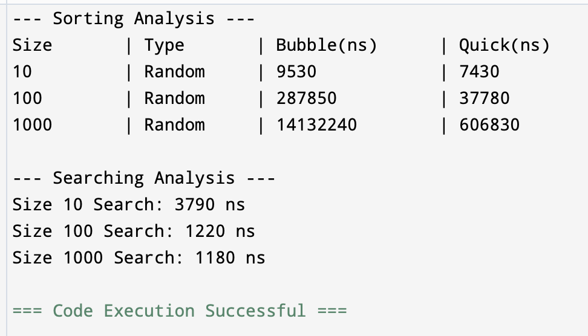

# assignment3-sorting-searching-
# Assignment 3: Sorting and Searching Analysis System

## 1. Project Overview
This project implements and compares different sorting and searching algorithms to analyze their performance using execution time.

Algorithms chosen:
Basic Sorting: Bubble Sort
Advanced Sorting: Quick Sort
Searching: Binary Search

## 2. Algorithm Descriptions
Bubble Sort: A simple algorithm that repeatedly steps through the list, compares adjacent elements and swaps them if they are in the wrong order. Complexity: O(n²).
Quick Sort: A divide-and-conquer algorithm that picks an element as a pivot and partitions the given array around the picked pivot. Complexity: O(n log n).
Binary Search: Finds the position of a target value within a sorted array by repeatedly dividing the search interval in half. Complexity: O(log n).

## 3. Analysis Questions
**Which sorting algorithm performed faster? Why?**
Quick Sort is much faster on larger datasets (1000+ elements) because its average time complexity is O(n log n), while Bubble Sort is O(n²).
How does performance change with input size?
As the size of the array increases, Bubble Sort's execution time grows quadratically, whereas Quick Sort's time grows much more slowly (almost linearly).
Does Binary Search require a sorted array?
Yes, Binary Search only works on sorted arrays because it relies on the order to decide which half of the array to eliminate.

## 4. Screenshots

